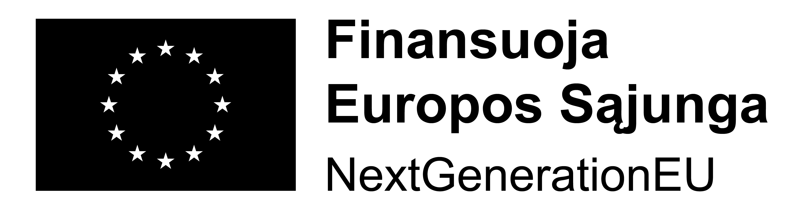

## Finansuojama Ekonomikos gaivinimo ir atsparumo didinimo plano „Naujos Kartos Lietuva“ (NextGenerationEU) lėšomis

UAB „Arch 13“ savo veikloje diegia dirbtinio intelekto (AI) sprendimus ES struktūrinių fondų pagalba.
Įgyvendinamo projekto tikslas – sukurti dirbtinio intelekto platformą, skirtą verslo konsultavimo įmonėms ir jų klientams, DI verslo konsultanto asistento pavidalu, kuri galėtų atlikti pirminį klientų konsultavimą 24/7, pateikti išvadas apie klientų atitiktį konkrečiai finansavimo priemonei ir paruošti pirminio konsultavimo dokumentus klientams ir konsultacinių įmonių darbuotojams.
Projektas įgyvendinamas pagal priemonę Nr. 05-001-01-05-05 „Skatinti įmones skaitmenizuotis“ veiklos „Finansinės paskatos startuoliams ir atžalinėms įmonėms kurti DI, blokų grandinės technologijų, robotikos procesų automatizavimo produktus ir sprendimus“.

Tinkamos finansuoti išlaidos – 98 415,77 Eur

Finansavimo suma – 83 720,12Eur.

Projektas bus įgyvendinamas iki 2025 balandžio 30 d.

